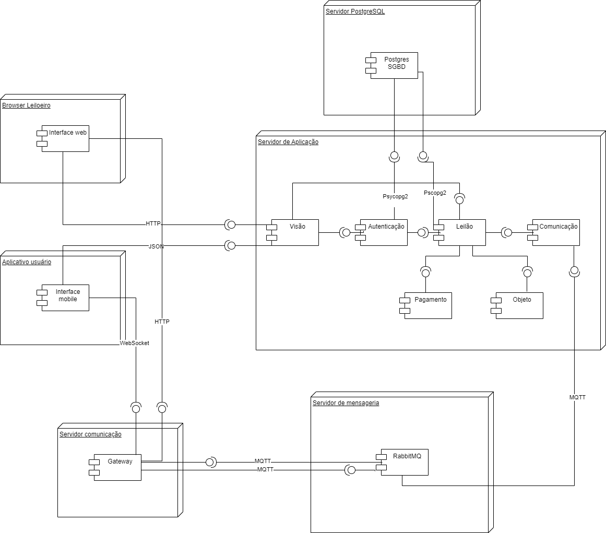

# TopBids

## Alunos

### Diogo Martins de Assis <diogomrtsa@gmail.com>

### Gabriel Dolabela Marques <dolabelag@gmail.com>

### Henrique Carvalho Almeida <me@h3nc4.com>

### João Francisco Carvalho Soares de Oliveira Queiroga <queiroga.joaofcsol@gmail.com>

### João Pedro de Oliveira Pauletti <jpedropauletti@gmail.com>

### Lucas Monteiro Lima <lutrinde@gmail.com>

### Renato Paganini Thurler Filho <paganini.thurler@outlook.com>

---

## Professores

### Hugo Bastos de Paula

### Cleiton Silva Tavares

### Pedro Pongelupe Lopes

---

_Curso de Engenharia de Software, Unidade Praça da Liberdade_

_Instituto de Informática e Ciências Exatas – Pontifícia Universidade de Minas Gerais (PUC MINAS), Belo Horizonte – MG – Brasil_

---

_**Resumo**. Escrever aqui o resumo. O resumo deve contextualizar rapidamente o trabalho, descrever seu objetivo e, ao final,
mostrar algum resultado relevante do trabalho (até 10 linhas)._

---

## Histórico de Revisões

| **Data** | **Autor** | **Descrição** | **Versão** |
| --- | --- | --- | --- |
| **[dd/mm/aaaa]** | [Nome do autor] | [Descrever as principais alterações realizadas no documento, evidenciando as seções ou capítulos alterados] | [X] |
| | | | |
| | | | |

## SUMÁRIO

1. [Apresentação](#apresentacao "Apresentação")  
    1.1. Problema  
    1.2. Objetivos do trabalho  
    1.3. Definições e Abreviaturas  

2. [Requisitos](#requisitos "Requisitos")  
    2.1. Requisitos Funcionais  
    2.2. Requisitos Não-Funcionais  
    2.3. Restrições Arquiteturais  
    2.4. Mecanismos Arquiteturais  

3. [Modelagem](#modelagem "Modelagem e projeto arquitetural")  
    3.1. Visão de Negócio  
    3.2. Visão Lógica  
    3.3. Modelo de dados (opcional)  

4. [Solução](#solucao "Projeto da Solução")  

5. [Avaliação](#avaliacao "Avaliação da Arquitetura")  
    5.1. Cenários  
    5.2. Avaliação  

6. [Referências](#referencias "REFERÊNCIAS")  

7. [Apêndices](#apendices "APÊNDICES")

# 1. Apresentação

Os leilões são eventos que têm sido uma parte significativa do comércio e troca de bens há séculos. No contexto atual, onde a digitalização e a conveniência são valorizadas, a transição para platafor-mas online para conduzir leilões se tornou uma tendência crescente. Esta iniciativa visa capitalizar essa tendência, proporcionando uma plataforma robusta e intuitiva para a realização de leilões onli-ne.
De acordo com estatísticas recentes, o mercado de leilões online está crescendo a uma taxa anual significativa, em 2021, o volume total de vendas em leilões online foi estimado em mais de $900 bilhões de dólares, representando um aumento considerável em relação aos anos anteriores. Este crescimento evidencia a demanda crescente por plataformas eficientes e seguras para a realização de leilões online.

## 1.1. Problema

Nos leilões tradicionais, tanto os leiloeiros quanto os participantes enfrentam diversos obstáculos que prejudicam a eficiência e a comodidade do processo. A falta de uma plataforma digital dedicada muitas vezes resulta em dificuldades para registrar itens, comunicar lances, garantir o anonimato dos participantes e manter um histórico transparente de lances. Além disso, a comunicação entre leiloeiro e compradores muitas vezes é limitada, o que pode comprometer a experiência do usuário e afetar negativamente os resultados do leilão.
A motivação por trás do desenvolvimento da aplicação de leilões é abordar os desafios enfrentados pelos leiloeiros e participantes, proporcionando uma solução digital completa e eficiente. Ao introdu-zir recursos como registro fácil de itens, tecnologia de mensageria para disputa de valores, chats dedicados para compradores e leiloeiros, garantia de anonimato e histórico transparente de lances, a aplicação visa melhorar significativamente a experiência de todos os envolvidos no processo de leilão.
O mercado de lances online, em 2021, era de $5.9B, registrando uma alta movimentação, e esti-mando-se um crescimento de 9.7% até 2026, com as novas gerações sendo o motivo no aumento.

## 1.2. Objetivos do trabalho

### 1.2.1. Objetivo Geral

Desenvolver uma aplicação na área de leilão, para proporcionar uma plataforma digital robusta e intuitiva que facilite a realização de leilões online, visando aprimorar a experiência dos leiloeiros e participantes, garantindo eficiência, segurança e transparência ao processo de leilão.

### 1.2.2. Objetivos Específicos

Os objetivos específicos delineados para o desenvolvimento da aplicação de leilão visam abordar diferentes aspectos-chave para garantir a eficiência, segurança e comodidade tanto para os leiloei-ros quanto para os participantes.
Para facilitar o processo de participação nos leilões, é necessário desenvolver operações CRUD para gerenciar tanto os cartões de crédito dos usuários quanto os itens que serão leiloados. Isso inclui a capacidade de adicionar, visualizar, editar e excluir informações de cartões e produtos de forma intuitiva e segura.
Além disso, a integração de funcionalidades como definição de datas de leilão, início e fechamento, juntamente com sistemas de mensagens que permitam a comunicação em tempo real entre compra-dores e leiloeiros, é essencial para garantir transparência e facilitar as interações durante os even-tos de leilão.
Vamos implementar uma arquitetura escalável que possa lidar com um grande volume de usuários e transações durante os leilões, garantindo uma experiência fluida mesmo em momentos de alta de-manda.
A segurança e o anonimato dos usuários também são prioridades, exigindo a implementação de medidas robustas de proteção de dados e privacidade, como criptografia e autenticação de usuário.
Para facilitar a descoberta e participação nos leilões, serão desenvolvidas funcionalidades de con-sulta que permitam aos usuários pesquisar itens disponíveis e eventos de leilão agendados para datas específicas, além da integração de um calendário na página inicial para uma visão geral dos próximos eventos.
Finalmente, um sistema de notificação será implementado para informar os usuários sobre eventos importantes, como leilões próximos e atualizações na plataforma, enquanto as opções de realização de lances específicos e cobertura do maior lance garantirão uma competição justa e dinâmica duran-te os leilões, atendendo às necessidades e expectativas tanto dos leiloeiros quanto dos participantes.

## 1.3. Definições e Abreviaturas

CRUD: Criar, Ler, Atualizar e Deletar (Create, Read, Update, Delete)
RMQ: RabbitMQ
API: Application Programming Interface
AWS: Amazon Web Services
Django: Framework de desenvolvimento web para Python
ORM: Object-Relational Mapping
Flutter: Framework de desenvolvimento de aplicativos móveis
Bootsrap: Framework de desenvolvimento web para HTML, CSS e JavaScript
CSS: Cascading Style Sheets
Docker: Plataforma de código aberto para automação de implantação de aplicativos

Coloque aqui as definições, siglas e abreviaturas utilizadas no trabalho._

# 2. Requisitos

_Esta seção descreve os requisitos comtemplados nesta descrição arquitetural, divididos em dois grupos: funcionais e não funcionais._

## 2.1. Requisitos Funcionais

| **ID** | **Descrição** | **Prioridade** | **Plataforma** |
| --- | --- | --- | --- |
| RF001 | Comprador gerencia conta | ESSENCIAL | web/mobile |
| RF002 | Comprador gerencia formas de pagamento | ESSENCIAL | web/mobile |
| RF003 | Leiloeiro gerencia item para leilão | ESSENCIAL | web/mobile |
| RF004 | Leiloeiro gerencia leilão | ESSENCIAL | web/mobile |
| RF005 | Leiloeiro gerencia data do leilão | ESSENCIAL | web/mobile |
| RF006 | Usuário consulta calendário de leilões marcados | ESSENCIAL | web/mobile |
| RF007 | Usuário pesquisa item | ESSENCIAL | web/mobile |
| RF008 | Usuário consulta calendário na land page | ESSENCIAL | web/mobile |
| RF009 | Leiloeiro define valor inicial do item | ESSENCIAL | web/mobile |
| RF010 | Leiloeiro define o valor mínimo/máximo que o lance deve ser | ESSENCIAL | web/mobile |
| RF011 | Usuário manda mensagem para outro usuário | ESSENCIAL | web/mobile |
| RF012 | Comprador manda mensagem para o leiloeiro após ganhar | ESSENCIAL | web/mobile |
| RF013 | Leiloeiro define tempo de espera máximo para lance, antes finalizar o leilão  | ESSENCIAL | web/mobile |
| RF014 | Sistema valida item | ESSENCIAL | web/mobile |
| RF015 | Usuário marca leilão que quer participar para receber notificação | ESSENCIAL | web/mobile |
| RF016 | Sistema notifica início de leilão para os usuários que o marcaram | ESSENCIAL | web/mobile |
| RF017 | Usuário consulta histórico de lances | ESSENCIAL | web/mobile |
| RF018 | Comprador consulta log do chat do leilão | ESSENCIAL | web/mobile |

## 2.2. Requisitos Não-Funcionais

| **ID** | **Descrição** |
| --- | --- |
| RNF001 | Sistema suporta cerca de 500 usuários |
| RNF002 | Leilão disponibiliza chat em tempo real |
| RNF003 | Sistema protege dados do usuário (qual nível de proteção???) |
| RNF004 | Sistema notifica usuário 2 horas antes |

## 2.3. Restrições Arquiteturais

As restrições impostas ao projeto que afetam sua arquitetura são:
• O software deverá ser desenvolvido em Python/Django: A arquitetura do sis-tema deve ser baseada no framework Django para o desenvolvimento do backend da aplicação, aproveitando as funcionalidades e convenções ofereci-das por esse framework para agilizar o processo de desenvolvimento.
• Utilização de Bootstrap + CSS para o frontend web: A arquitetura do frontend web deve ser desenvolvida utilizando a combinação do framework Bootstrap com CSS para a criação de interfaces de usuário responsivas e visualmente atraentes, seguindo as melhores práticas de design e usabilidade.
• Utilização do framework Flutter para o desenvolvimento mobile: A arquitetura da aplicação móvel deve ser projetada utilizando o framework Flutter, que permite o desenvolvimento de aplicativos móveis nativos de alta qualidade pa-ra Android e iOS a partir de um único código-fonte, garantindo consistência e eficiência no desenvolvimento.
• Hospedagem na AWS (Amazon Web Services): A arquitetura do sistema de-ve ser projetada para ser implantada e hospedada na plataforma de serviços em nuvem da AWS, aproveitando a infraestrutura escalável, confiável e segu-ra oferecida por essa plataforma.
• Utilização de RMQ (RabbitMQ) para mensageria: A arquitetura da aplicação deve ser projetada para integrar o RMQ como sistema de mensageria, permi-tindo a comunicação síncrona e distribuída entre os diferentes componentes da aplicação, garantindo uma arquitetura robusta e escalável.
• Utilização de Docker para contêineres: A arquitetura da aplicação deve ser projetada para utilizar o Docker para a criação, implantação e execução de contêineres, garantindo a portabilidade e a consistência do ambiente de de-senvolvimento, teste e produção.

## 2.4. Mecanismos Arquiteturais

| **Análise** | **Design** | **Implementação** |
| --- | --- | --- |
| Persistência | ORM | DjangoRM |
| Front end | Figma | Django Template Engine e Flutter |
| Back end | | Ninja, Django e RabbitMQ |
| Integração | | |
| Log do sistema | | Shell |
| Teste de Software | | Django |
| Deploy | | AWS |

# 3. Modelagem e Projeto Arquitetural

_Apresente uma visão geral da solução proposta para o projeto e explique brevemente esse diagrama de visão geral, de forma textual. Esse diagrama não precisa seguir os padrões da UML, e deve ser completo e tão simples quanto possível, apresentando a macroarquitetura da solução._

**Figura 1 - Visão Geral da Solução (fonte: <https://medium.com>)**

Obs: substitua esta imagem por outra, adequada ao seu projeto (cada arquitetura é única).

## 3.1. Visão de Negócio (Funcionalidades)

_Apresente uma lista simples com as funcionalidades previstas no projeto (escopo do produto)._

1. O sistema deve...
2. O sistema deve...
3. ...

Obs: a quantidade e o escopo das funcionalidades deve ser negociado com os professores/orientadores do trabalho.

### Histórias de Usuário

_Nesta seção, você deve descrever estórias de usuários seguindo os métodos ágeis. Lembre-se das características de qualidade das estórias de usuários, ou seja, o que é preciso para descrever boas histórias de usuários._

Exemplos de Histórias de Usuário:

- Como Fulano eu quero poder convidar meus amigos para que a gente possa se reunir...

- Como Cicrano eu quero poder organizar minhas tarefas diárias, para que...

- Como gerente eu quero conseguir entender o progresso do trabalho do meu time, para que eu possa ter relatórios periódicos dos nossos acertos e falhas.

## 3.2. Visão Lógica

_Apresente os artefatos que serão utilizados descrevendo em linhas gerais as motivações que levaram a equipe a utilizar estes diagramas._

### Diagrama de Classes

**Figura 2 – Diagrama de classes (exemplo). Fonte: o próprio autor.**

Obs: Acrescente uma breve descrição sobre o diagrama apresentado na Figura 3.

### Diagrama de componentes

_Apresente o diagrama de componentes da aplicação, indicando, os elementos da arquitetura e as interfaces entre eles. Liste os estilos/padrões arquiteturais utilizados e faça uma descrição sucinta dos componentes indicando o papel de cada um deles dentro da arquitetura/estilo/padrão arquitetural. Indique também quais componentes serão reutilizados (navegadores, SGBDs, middlewares, etc), quais componentes serão adquiridos por serem proprietários e quais componentes precisam ser desenvolvidos._

**Figura 3 – Diagrama de Componentes (exemplo). Fonte: o próprio autor.**

_Apresente uma descrição detalhada dos artefatos que constituem o diagrama de implantação._

Ex: conforme diagrama apresentado na Figura X, as entidades participantes da solução são:

- **Componente 1** - Lorem ipsum dolor sit amet, consectetur adipiscing elit. Cras nunc magna, accumsan eget porta a, tincidunt sed mauris. Suspendisse orci nulla, sagittis a lorem laoreet, tincidunt imperdiet ipsum. Morbi malesuada pretium suscipit.
- **Componente 2** - Praesent nec nisi hendrerit, ullamcorper tortor non, rutrum sem. In non lectus tortor. Nulla vel tincidunt eros.

## 3.3. Modelo de dados (opcional)

_Caso julgue necessário para explicar a arquitetura, apresente o diagrama de classes ou diagrama de Entidade/Relacionamentos ou tabelas do banco de dados. Este modelo pode ser essencial caso a arquitetura utilize uma solução de banco de dados distribuídos ou um banco NoSQL._

 ")

**Figura 4 – Diagrama de Entidade Relacionamento (ER) - exemplo. Fonte: o próprio autor.**

Obs: Acrescente uma breve descrição sobre o diagrama apresentado na Figura 3.

# 4. Projeto da Solução

_Apresente as telas dos sistema construído com uma descrição sucinta de cada uma das interfaces._

# 5. Avaliação da Arquitetura

_Esta seção descreve a avaliação da arquitetura apresentada, baseada no método ATAM._

## 5.1. Cenários

_Apresente os cenários de testes utilizados na realização dos testes da sua aplicação. Escolha cenários de testes que demonstrem os requisitos não funcionais sendo satisfeitos. Os requisitos a seguir são apenas exemplos de possíveis requisitos, devendo ser revistos, adequados a cada projeto e complementados de forma a terem uma especificação completa e auto-explicativa._

**Cenário 1 - Acessibilidade:** Suspendisse consequat consectetur velit. Sed sem risus, dictum dictum facilisis vitae, commodo quis leo. Vivamus nulla sem, cursus a mollis quis, interdum at nulla. Nullam dictum congue mauris. Praesent nec nisi hendrerit, ullamcorper tortor non, rutrum sem. In non lectus tortor. Nulla vel tincidunt eros.

**Cenário 2 - Interoperabilidade:** Pellentesque habitant morbi tristique senectus et netus et malesuada fames ac turpis egestas. Fusce ut accumsan erat. Pellentesque in enim tempus, iaculis sem in, semper arcu.

**Cenário 3 - Manutenibilidade:** Phasellus magna tellus, consectetur quis scelerisque eget, ultricies eu ligula. Sed rhoncus fermentum nisi, a ullamcorper leo fringilla id. Nulla lacinia sem vel magna ornare, non tincidunt ipsum rhoncus. Nam euismod semper ante id tristique. Mauris vel elit augue.

**Cenário 4 - Segurança:** Suspendisse consectetur porta tortor non convallis. Sed lobortis erat sed dignissim dignissim. Nunc eleifend elit et aliquet imperdiet. Ut eu quam at lacus tincidunt fringilla eget maximus metus. Praesent finibus, sapien eget molestie porta, neque turpis congue risus, vel porttitor sapien tortor ac nulla. Aliquam erat volutpat.

## 5.2. Avaliação

_Apresente as medidas registradas na coleta de dados. O que não for possível quantificar apresente uma justificativa baseada em evidências qualitativas que suportam o atendimento do requisito não-funcional. Apresente uma avaliação geral da arquitetura indicando os pontos fortes e as limitações da arquitetura proposta._

| **Atributo de Qualidade:** | Segurança |
| --- | --- |
| **Requisito de Qualidade** | Acesso aos recursos restritos deve ser controlado |
| **Preocupação:** | Os acessos de usuários devem ser controlados de forma que cada um tenha acesso apenas aos recursos condizentes as suas credenciais. |
| **Cenários(s):** | Cenário 4 |
| **Ambiente:** | Sistema em operação normal |
| **Estímulo:** | Acesso do administrador do sistema as funcionalidades de cadastro de novos produtos e exclusão de produtos. |
| **Mecanismo:** | O servidor de aplicação (Rails) gera um _token_ de acesso para o usuário que se autentica no sistema. Este _token_ é transferido para a camada de visualização (Angular) após a autenticação e o tratamento visual das funcionalidades podem ser tratados neste nível. |
| **Medida de Resposta:** | As áreas restritas do sistema devem ser disponibilizadas apenas quando há o acesso de usuários credenciados. |

**Considerações sobre a arquitetura:**

| **Riscos:** | Não existe |
| --- | --- |
| **Pontos de Sensibilidade:** | Não existe |
| _**Tradeoff**_ **:** | Não existe |

Evidências dos testes realizados

_Apresente imagens, descreva os testes de tal forma que se comprove a realização da avaliação._

# 6. REFERÊNCIAS

_Como um projeto da arquitetura de uma aplicação não requer revisão bibliográfica, a inclusão das referências não é obrigatória. No entanto, caso você deseje incluir referências relacionadas às tecnologias, padrões, ou metodologias que serão usadas no seu trabalho, relacione-as de acordo com a ABNT._

Verifique no link abaixo como devem ser as referências no padrão ABNT:

<http://www.pucminas.br/imagedb/documento/DOC\_DSC\_NOME\_ARQUI20160217102425.pdf>

**[1]** - _ELMASRI, Ramez; NAVATHE, Sham. **Sistemas de banco de dados**. 7. ed. São Paulo: Pearson, c2019. E-book. ISBN 9788543025001._

**[2]** - _COPPIN, Ben. **Inteligência artificial**. Rio de Janeiro, RJ: LTC, c2010. E-book. ISBN 978-85-216-2936-8._

**[3]** - _CORMEN, Thomas H. et al. **Algoritmos: teoria e prática**. Rio de Janeiro, RJ: Elsevier, Campus, c2012. xvi, 926 p. ISBN 9788535236996._

**[4]** - _SUTHERLAND, Jeffrey Victor. **Scrum: a arte de fazer o dobro do trabalho na metade do tempo**. 2. ed. rev. São Paulo, SP: Leya, 2016. 236, [4] p. ISBN 9788544104514._

**[5]** - _RUSSELL, Stuart J.; NORVIG, Peter. **Inteligência artificial**. Rio de Janeiro: Elsevier, c2013. xxi, 988 p. ISBN 9788535237016._

# 7. APÊNDICES

_Inclua o URL do repositório (Github, Bitbucket, etc) onde você armazenou o código da sua prova de conceito/protótipo arquitetural da aplicação como anexos. A inclusão da URL desse repositório de código servirá como base para garantir a autenticidade dos trabalhos._
