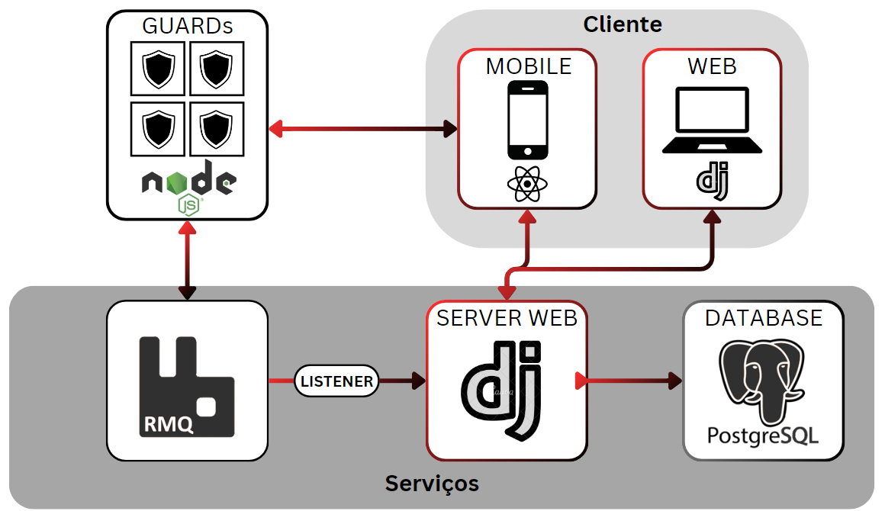

# TopBids

## Alunos

### Diogo Martins de Assis <diogomrtsa@gmail.com>

### Gabriel Dolabela Marques <dolabelag@gmail.com>

### Henrique Carvalho Almeida <me@h3nc4.com>

### João Francisco Carvalho Soares de Oliveira Queiroga <queiroga.joaofcsol@gmail.com>

### João Pedro de Oliveira Pauletti <jpedropauletti@gmail.com>

### Lucas Monteiro Lima <lutrinde@gmail.com>

### Renato Paganini Thurler Filho <paganini.thurler@outlook.com>

---

## Professores

### Hugo Bastos de Paula

### Cleiton Silva Tavares

### Pedro Pongelupe Lopes

---

`Curso de Engenharia de Software, Unidade Praça da Liberdade`

`Instituto de Informática e Ciências Exatas – Pontifícia Universidade de Minas Gerais (PUC MINAS), Belo Horizonte – MG – Brasil`

---

## Resumo

Nos leilões tradicionais, tanto os leiloeiros quanto os participantes enfrentam diversos obstáculos que prejudicam a eficiência e a comodidade do processo. A falta de uma plataforma digital dedicada muitas vezes limita as operações, o que pode comprometer a experiência do usuário e afetar negativamente os resultados do leilão.

O objetivo do projeto é desenvolver uma aplicação na área de leilão, para proporcionar uma plataforma digital robusta e intuitiva que facilite a realização de leilões online, visando aprimorar a experiência dos leiloeiros e participantes, garantindo eficiência, segurança e transparência ao processo de leilão.

---

## Histórico de Revisões

| **Data** | **Autor** | **Descrição** | **Versão** |
| --- | --- | --- | --- |
| **29/02/2024** | Henrique | Informações dos autores | 0.1 |
| **12/03/2024** | João Pauletti | Definição da seção 1 | 1.0 |
| **13/03/2024** | Lucas | Definição da seção 2 | 1.1 |
| **13/03/2024** | João Queiroga | Definição da seção 2 | 1.2 |
| **13/03/2024** | Renato | Definição da seção 3.1 | 1.3 |
| **14/03/2024** | Gabriel | Definição da seção 3.2 | 1.4 |
| **14/03/2024** | Henrique | Formatação do documento | 1.4.1 |

## SUMÁRIO

1. [Apresentação](#1-apresentação "Apresentação")  
    1.1. [Problema](#11-problema "Problema")  
    1.2. [Objetivos do trabalho](#12-objetivos-do-trabalho "Objetivos do trabalho")  
    1.3. [Definições e Abreviaturas](#13-definições-e-abreviaturas "Definições e Abreviaturas")  

2. [Requisitos](#2-requisitos "Requisitos")  
    2.1. [Requisitos Funcionais](#21-requisitos-funcionais "Requisitos Funcionais")  
    2.2. [Requisitos Não-Funcionais](#22-requisitos-não-funcionais "Requisitos Não-Funcionais")  
    2.3. [Restrições Arquiteturais](#23-restrições-arquiteturais "Restrições Arquiteturais")  
    2.4. [Mecanismos Arquiteturais](#24-mecanismos-arquiteturais "Mecanismos Arquiteturais")  

3. [Modelagem](#3-modelagem-e-projeto-arquitetural "Modelagem e Projeto Arquitetural")  
    3.1. [Visão de Negócio](#31-visão-de-negócio-funcionalidades "Visão de Negócio (Funcionalidades)")  
    3.2. [Visão Lógica](#32-visão-lógica "Visão Lógica")  

4. [Solução](#4-projeto-da-solução "Solução")  

5. [Avaliação](#5-avaliação-da-arquitetura "Avaliação da Arquitetura")  
    5.1. [Cenários](#51-cenários "Cenários")  
    5.2. [Avaliação](#52-avaliação "Avaliação")  

6. [Referências](#6-referências "Referências")  

7. [Apêndices](#7-apêndices "Apêndices")

# 1. Apresentação

Os leilões são eventos que têm sido uma parte significativa do comércio e troca de bens há séculos. No contexto atual, onde a digitalização e a conveniência são valorizadas, a transição para platafor-mas online para conduzir leilões se tornou uma tendência crescente. Esta iniciativa visa capitalizar essa tendência, proporcionando uma plataforma robusta e intuitiva para a realização de leilões onli-ne.  
De acordo com estatísticas recentes, o mercado de leilões online está crescendo a uma taxa anual significativa, em 2021, o volume total de vendas em leilões online foi estimado em mais de $900 bilhões de dólares, representando um aumento considerável em relação aos anos anteriores. Este crescimento evidencia a demanda crescente por plataformas eficientes e seguras para a realização de leilões online.

## 1.1. Problema

Nos leilões tradicionais, tanto os leiloeiros quanto os participantes enfrentam diversos obstáculos que prejudicam a eficiência e a comodidade do processo. A falta de uma plataforma digital dedicada muitas vezes resulta em dificuldades para registrar itens, comunicar lances, garantir o anonimato dos participantes e manter um histórico transparente de lances. Além disso, a comunicação entre leiloeiro e compradores muitas vezes é limitada, o que pode comprometer a experiência do usuário e afetar negativamente os resultados do leilão.

A motivação por trás do desenvolvimento da aplicação de leilões é abordar os desafios enfrentados pelos leiloeiros e participantes, proporcionando uma solução digital completa e eficiente. Ao introdu-zir recursos como registro fácil de itens, tecnologia de mensageria para disputa de valores, chats dedicados para compradores e leiloeiros, garantia de anonimato e histórico transparente de lances, a aplicação visa melhorar significativamente a experiência de todos os envolvidos no processo de leilão.

O mercado de lances online, em 2021, era de $5.9B, registrando uma alta movimentação, e esti-mando-se um crescimento de 9.7% até 2026, com as novas gerações sendo o motivo no aumento.

## 1.2. Objetivos do trabalho

### 1.2.1. Objetivo Geral

Desenvolver uma aplicação na área de leilão, para proporcionar uma plataforma digital robusta e intuitiva que facilite a realização de leilões online, visando aprimorar a experiência dos leiloeiros e participantes, garantindo eficiência, segurança e transparência ao processo de leilão.

### 1.2.2. Objetivos Específicos

Os objetivos específicos delineados para o desenvolvimento da aplicação de leilão visam abordar diferentes aspectos-chave para garantir a eficiência, segurança e comodidade tanto para os leiloei-ros quanto para os participantes.  
Para facilitar o processo de participação nos leilões, é necessário desenvolver operações CRUD para gerenciar tanto os cartões de crédito dos usuários quanto os itens que serão leiloados. Isso inclui a capacidade de adicionar, visualizar, editar e excluir informações de cartões e produtos de forma intuitiva e segura.  
Além disso, a integração de funcionalidades como definição de datas de leilão, início e fechamento, juntamente com sistemas de mensagens que permitam a comunicação em tempo real entre compra-dores e leiloeiros, é essencial para garantir transparência e facilitar as interações durante os even-tos de leilão.  
Vamos implementar uma arquitetura escalável que possa lidar com um grande volume de usuários e transações durante os leilões, garantindo uma experiência fluida mesmo em momentos de alta de-manda.  
A segurança e o anonimato dos usuários também são prioridades, exigindo a implementação de medidas robustas de proteção de dados e privacidade, como criptografia e autenticação de usuário.  
Para facilitar a descoberta e participação nos leilões, serão desenvolvidas funcionalidades de con-sulta que permitam aos usuários pesquisar itens disponíveis e eventos de leilão agendados para datas específicas, além da integração de um calendário na página inicial para uma visão geral dos próximos eventos.  
Finalmente, um sistema de notificação será implementado para informar os usuários sobre eventos importantes, como leilões próximos e atualizações na plataforma, enquanto as opções de realização de lances específicos e cobertura do maior lance garantirão uma competição justa e dinâmica duran-te os leilões, atendendo às necessidades e expectativas tanto dos leiloeiros quanto dos participantes.

## 1.3. Definições e Abreviaturas

CRUD: Criar, Ler, Atualizar e Deletar (Create, Read, Update, Delete)
RMQ: RabbitMQ
API: Application Programming Interface
AWS: Amazon Web Services
Django: Framework de desenvolvimento web para Python
ORM: Object-Relational Mapping
Flutter: Framework de desenvolvimento de aplicativos móveis
Bootsrap: Framework de desenvolvimento web para HTML, CSS e JavaScript
CSS: Cascading Style Sheets

Coloque aqui as definições, siglas e abreviaturas utilizadas no trabalho._

# 2. Requisitos

## 2.1. Requisitos Funcionais

| **ID** | **Descrição** | **Prioridade** | **Plataforma** |
| --- | --- | --- | --- |
| RF001 | Comprador gerencia conta | ESSENCIAL | web |
| RF002 | Leiloeiro gerencia item para leilão | ESSENCIAL | web |
| RF003 | Leiloeiro gerencia leilão | ESSENCIAL | web |
| RF004 | Leiloeiro gerencia data do leilão | ESSENCIAL | web |
| RF005 | Usuário consulta calendário de leilões marcados | ESSENCIAL | mobile |
| RF006 | Usuário pesquisa item | ESSENCIAL | mobile |
| RF007 | Usuário entra em leilão | ESSENCIAL | mobile |
| RF008 | Usuário lança bids | ESSENCIAL | mobile |
| RF009 | Usuário consulta calendário na land page | ALTO | mobile |
| RF010 | Leiloeiro define valor inicial do item | ALTO | web |
| RF011 | Leiloeiro define o valor mínimo que o lance deve ser | ALTO | web |
| RF012 | Comprador envia pix para o leiloeiro após ganhar | ALTO | mobile |
| RF013 | Usuário manda mensagem para outro usuário | BAIXO | mobile |
| RF014 | Sistema valida item | BAIXO | web |
| RF015 | Usuário marca leilão que quer participar para receber notificação | BAIXO | mobile |
| RF016 | Usuário recebe notificação ao início de leilão que marcou | BAIXO | mobile |
| RF017 | Usuário consulta seu histórico de lances realizados | BAIXO | mobile |
| RF018 | Leiloeiro gerencia conta | BAIXO | web |

## 2.2. Requisitos Não-Funcionais

| **ID** | **Descrição** |
| --- | --- |
| RNF001 | Sistema suporta de 500 usuários |
| RNF002 | Sistema protege senhas do usuário criptografando-as utilizando algoritmo Argon2 |
| RNF003 | Tempo de resposta do sistema deve ser inferior a 2 segundos para a maioria das operações |
| RNF004 | O sistema deve ser hospedado em um servidor com pelo menos 4GB de RAM e 4 núcleos de processamento |

## 2.3. Restrições Arquiteturais

As restrições impostas ao projeto que afetam sua arquitetura são:

- A aplicação deve ser disponibilizada apenas no Brasil pois utiliza o sistema de pagamentos Pix.
- O software deverá ser desenvolvido em Python/Django: A arquitetura do sistema deve ser baseada no framework Django para o desenvolvimento do backend da aplicação, aproveitando as funcionalidades e convenções oferecidas por esse framework para agilizar o processo de desenvolvimento.
- A api deverá ser desenvolvida com a união de Django e Ninja: A arquitetura da aplicação deve ser projetada para utilizar o framework Ninja para o desenvolvimento de APIs RESTful capazes de fornecer acesso aos dados e à mensageria do sistema, garantindo uma comunicação eficiente e segura entre os diferentes componentes da aplicação.
- Utilização de Bootstrap + CSS para o frontend web: A arquitetura do frontend web deve ser desenvolvida utilizando a combinação do framework Bootstrap com CSS para a criação de interfaces de usuário responsivas e visualmente atraentes, seguindo as melhores práticas de design e usabilidade.
- Utilização do framework Flutter para o desenvolvimento mobile: A arquitetura da aplicação móvel deve ser projetada utilizando o framework Flutter, que permite o desenvolvimento de aplicativos móveis nativos de alta qualidade para Android e iOS a partir de um único código-fonte, garantindo consistência e eficiência no desenvolvimento.
- Hospedagem na AWS (Amazon Web Services): A arquitetura do sistema deve ser projetada para ser implantada e hospedada na plataforma de serviços em nuvem da AWS, aproveitando a infraestrutura escalável, confiável e segura oferecida por essa plataforma.
- Utilização de RMQ (RabbitMQ) para mensageria: A arquitetura da aplicação deve ser projetada para integrar o RMQ como sistema de mensageria, permitindo a comunicação síncrona e distribuída entre os diferentes componentes da aplicação, garantindo uma arquitetura robusta e escalável.

## 2.4. Mecanismos Arquiteturais

| **Análise** | **Design** | **Implementação** |
| --- | --- | --- |
| Persistência | ORM | DjangoRM |
| Front end | Figma | Django Template Engine e Flutter |
| Back end | MVC | Django e RabbitMQ |
| Integração | API | Ninja |
| Log do sistema | Shell | Bash |
| Teste de Software | Unitário | Django |
| Deploy | Microsserviço | AWS |

# 3. Modelagem e Projeto Arquitetural

## 3.1. Visão de Negócio (Funcionalidades)

1. O sistema deve permitir que o leiloeiro cadastre um item para leilão.
2. O sistema deve permitir que o leiloeiro defina o valor inicial do item.
3. O sistema deve permitir que o leiloeiro defina o valor mínimo/máximo que o lance deve ser.
4. O sistema deve permitir que o leiloeiro defina o tempo de espera máximo para lance, antes de finalizar o leilão.
5. O sistema deve permitir que o leiloeiro gerencie o leilão.
6. O sistema deve permitir que o leiloeiro gerencie a data do leilão.
7. O sistema deve permitir que o comprador gerencie sua conta.
8. O sistema deve permitir que o comprador gerencie suas formas de pagamento.
9. O sistema deve permitir que o usuário consulte o calendário de leilões marcados.
10. O sistema deve permitir que o usuário pesquise um item.
11. O sistema deve permitir que o usuário consulte o calendário na land page.
12. O sistema deve permitir que o usuário mande mensagem para outro usuário.
13. O sistema deve permitir que o comprador mande mensagem para o leiloeiro após ganhar.
14. O sistema deve permitir que o sistema valide o item.
15. O sistema deve permitir que o usuário marque o leilão que quer participar para receber notificação.
16. O sistema deve permitir que o sistema notifique o início de leilão para os usuários que o marcaram.
17. O sistema deve permitir que o usuário consulte o histórico de lances.
18. O sistema deve permitir que o comprador consulte o log do chat do leilão.

### Histórias de Usuário

- Como **comprador**, eu quero **gerenciar minha conta** para que eu possa **atualizar meus dados pessoais**.
- Como **comprador**, eu quero **gerenciar minhas formas de pagamento** para que eu possa **adicionar ou remover cartões de crédito**.
- Como **leiloeiro**, eu quero **gerenciar um item para leilão** para que eu possa **adicionar, visualizar, editar e excluir informações de itens**.
- Como **leiloeiro**, eu quero **gerenciar um leilão** para que eu possa **adicionar, visualizar, editar e excluir informações de leilões**.
- Como **leiloeiro**, eu quero **gerenciar a data do leilão** para que eu possa **adicionar, visualizar, editar e excluir informações de datas de leilões**.
- Como **usuário**, eu quero **consultar o calendário de leilões marcados** para que eu possa **verificar os próximos leilões**.
- Como **usuário**, eu quero **pesquisar um item** para que eu possa **encontrar um item específico**.
- Como **usuário**, eu quero **consultar o calendário na land page** para que eu possa **verificar os próximos leilões**.
- Como **leiloeiro**, eu quero **definir o valor inicial do item** para que eu possa **definir o valor inicial do item**.
- Como **leiloeiro**, eu quero **definir o valor mínimo/máximo que o lance deve ser** para que eu possa **definir o valor mínimo/máximo que o lance deve ser**.
- Como **usuário**, eu quero **mandar mensagem para outro usuário** para que eu possa **comunicar com outro usuário**.
- Como **comprador**, eu quero **mandar mensagem para o leiloeiro após ganhar** para que eu possa **comunicar com o leiloeiro**.
- Como **leiloeiro**, eu quero **definir o tempo de espera máximo para lance, antes de finalizar o leilão** para que eu possa **definir o tempo de espera máximo para lance, antes de finalizar o leilão**.
- Como **sistema**, eu quero **validar o item** para que eu possa **verificar se o item é válido**.
- Como **usuário**, eu quero **marcar o leilão que quero participar para receber notificação** para que eu possa **ser notificado sobre o leilão**.
- Como **sistema**, eu quero **notificar o início de leilão para os usuários que o marcaram** para que eu possa **notificar os usuários sobre o início do leilão**.
- Como **usuário**, eu quero **consultar o histórico de lances** para que eu possa **verificar o histórico de lances**.
- Como **comprador**, eu quero **consultar o log do chat do leilão** para que eu possa **verificar o log do chat do leilão**.

## 3.2. Visão Lógica

### Diagrama de Classes

### Diagrama de componentes/arquitetura

"Servidor PostgreSQL": Este é um servidor dedicado ao banco de dados PostgreSQL, que é responsável pelo armazenamento persistente dos dados da aplicação. O componente "Postgre SGBD" é utilizado para armazenar e gerenciar os dados da aplicação.

"Servidor de Aplicação": Este servidor é responsável por hospedar a lógica de negócios da aplicação. Ele hospeda diversos componentes, incluindo:

- **Visão**: Este componente lida com a apresentação de informações para os usuários finais. Renderiza páginas HTML, processando solicitações de interface do usuário e as enviando para os clientes.
- **Autenticação**: Responsável pela autenticação de usuários, garantindo que apenas usuários autorizados tenham acesso às funcionalidades de acordo com suas permissões definidas.
- **Leilão**: Gerencia os processos relacionados aos leilões, incluindo a criação e encerramento de leilões e recebe as atualizações de lances dos usuários.
- **Comunicação**: Responsável pela comunicação entre o leilão e os usuários, repassando mensagens e notificações para o componente Leilão.
- **Pagamento**: Permite inserção de chaves pix pelo vendedor e confirmação de pagamento por ambas as partes.

"Servidor de Mensageria": Sistema de mensageria que permite a comunicação assíncrona entre os diferentes componentes da aplicação. Ele atua como intermediário para a troca de mensagens entre os diferentes servidores e componentes, permitindo uma arquitetura distribuída e escalável.

"Aplicativo Usuário": Esta implantação refere-se ao aplicativo móvel que os usuários finais utilizam para interagir com o sistema. O componente "Interface Mobile" permite que os usuários visualizem e interajam com os leilões, façam lances recebam notificações e efetuem pagamentos.

"Browser Leiloeiro": Esta implantação refere-se à interface web destinada aos leiloeiros ou administradores do sistema. O componente "Interface Web" permite que os vendedores cadastrem-se e gerenciem seus produtos.

# 4. Projeto da Solução

_Apresente as telas dos sistema construído com uma descrição sucinta de cada uma das interfaces._

# 5. Avaliação da Arquitetura

_Esta seção descreve a avaliação da arquitetura apresentada, baseada no método ATAM._

## 5.1. Cenários

_Apresente os cenários de testes utilizados na realização dos testes da sua aplicação. Escolha cenários de testes que demonstrem os requisitos não funcionais sendo satisfeitos. Os requisitos a seguir são apenas exemplos de possíveis requisitos, devendo ser revistos, adequados a cada projeto e complementados de forma a terem uma especificação completa e auto-explicativa._

**Cenário 1 - Acessibilidade:** Suspendisse consequat consectetur velit. Sed sem risus, dictum dictum facilisis vitae, commodo quis leo. Vivamus nulla sem, cursus a mollis quis, interdum at nulla. Nullam dictum congue mauris. Praesent nec nisi hendrerit, ullamcorper tortor non, rutrum sem. In non lectus tortor. Nulla vel tincidunt eros.

**Cenário 2 - Interoperabilidade:** Pellentesque habitant morbi tristique senectus et netus et malesuada fames ac turpis egestas. Fusce ut accumsan erat. Pellentesque in enim tempus, iaculis sem in, semper arcu.

**Cenário 3 - Manutenibilidade:** Phasellus magna tellus, consectetur quis scelerisque eget, ultricies eu ligula. Sed rhoncus fermentum nisi, a ullamcorper leo fringilla id. Nulla lacinia sem vel magna ornare, non tincidunt ipsum rhoncus. Nam euismod semper ante id tristique. Mauris vel elit augue.

**Cenário 4 - Segurança:** Suspendisse consectetur porta tortor non convallis. Sed lobortis erat sed dignissim dignissim. Nunc eleifend elit et aliquet imperdiet. Ut eu quam at lacus tincidunt fringilla eget maximus metus. Praesent finibus, sapien eget molestie porta, neque turpis congue risus, vel porttitor sapien tortor ac nulla. Aliquam erat volutpat.

## 5.2. Avaliação

_Apresente as medidas registradas na coleta de dados. O que não for possível quantificar apresente uma justificativa baseada em evidências qualitativas que suportam o atendimento do requisito não-funcional. Apresente uma avaliação geral da arquitetura indicando os pontos fortes e as limitações da arquitetura proposta._

| **Atributo de Qualidade:** | Segurança |
| --- | --- |
| **Requisito de Qualidade** | Acesso aos recursos restritos deve ser controlado |
| **Preocupação:** | Os acessos de usuários devem ser controlados de forma que cada um tenha acesso apenas aos recursos condizentes as suas credenciais. |
| **Cenários(s):** | Cenário 4 |
| **Ambiente:** | Sistema em operação normal |
| **Estímulo:** | Acesso do administrador do sistema as funcionalidades de cadastro de novos produtos e exclusão de produtos. |
| **Mecanismo:** | O servidor de aplicação (Rails) gera um _token_ de acesso para o usuário que se autentica no sistema. Este _token_ é transferido para a camada de visualização (Angular) após a autenticação e o tratamento visual das funcionalidades podem ser tratados neste nível. |
| **Medida de Resposta:** | As áreas restritas do sistema devem ser disponibilizadas apenas quando há o acesso de usuários credenciados. |

**Considerações sobre a arquitetura:**

| **Riscos:** | Não existe |
| --- | --- |
| **Pontos de Sensibilidade:** | Não existe |
| _**Tradeoff**_ **:** | Não existe |

Evidências dos testes realizados

_Apresente imagens, descreva os testes de tal forma que se comprove a realização da avaliação._

# 6. REFERÊNCIAS

_Como um projeto da arquitetura de uma aplicação não requer revisão bibliográfica, a inclusão das referências não é obrigatória. No entanto, caso você deseje incluir referências relacionadas às tecnologias, padrões, ou metodologias que serão usadas no seu trabalho, relacione-as de acordo com a ABNT._

Verifique no link abaixo como devem ser as referências no padrão ABNT:

<http://www.pucminas.br/imagedb/documento/DOC\_DSC\_NOME\_ARQUI20160217102425.pdf>

**[1]** - _ELMASRI, Ramez; NAVATHE, Sham. **Sistemas de banco de dados**. 7. ed. São Paulo: Pearson, c2019. E-book. ISBN 9788543025001._

**[2]** - _COPPIN, Ben. **Inteligência artificial**. Rio de Janeiro, RJ: LTC, c2010. E-book. ISBN 978-85-216-2936-8._

**[3]** - _CORMEN, Thomas H. et al. **Algoritmos: teoria e prática**. Rio de Janeiro, RJ: Elsevier, Campus, c2012. xvi, 926 p. ISBN 9788535236996._

**[4]** - _SUTHERLAND, Jeffrey Victor. **Scrum: a arte de fazer o dobro do trabalho na metade do tempo**. 2. ed. rev. São Paulo, SP: Leya, 2016. 236, [4] p. ISBN 9788544104514._

**[5]** - _RUSSELL, Stuart J.; NORVIG, Peter. **Inteligência artificial**. Rio de Janeiro: Elsevier, c2013. xxi, 988 p. ISBN 9788535237016._

# 7. APÊNDICES

_Inclua o URL do repositório (Github, Bitbucket, etc) onde você armazenou o código da sua prova de conceito/protótipo arquitetural da aplicação como anexos. A inclusão da URL desse repositório de código servirá como base para garantir a autenticidade dos trabalhos._
